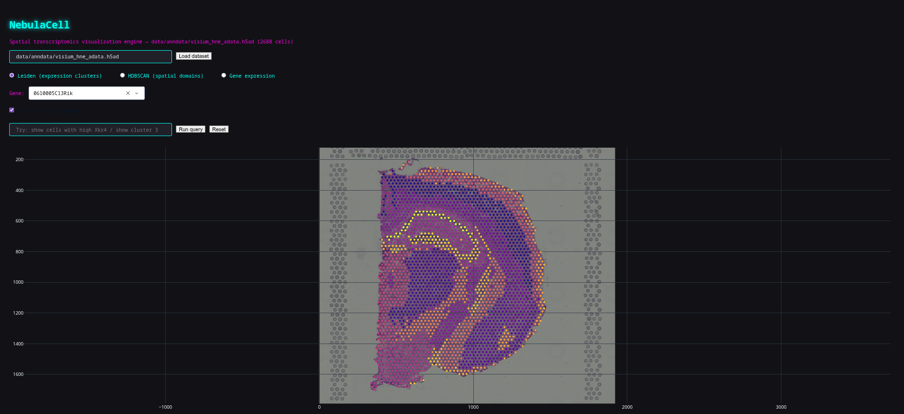
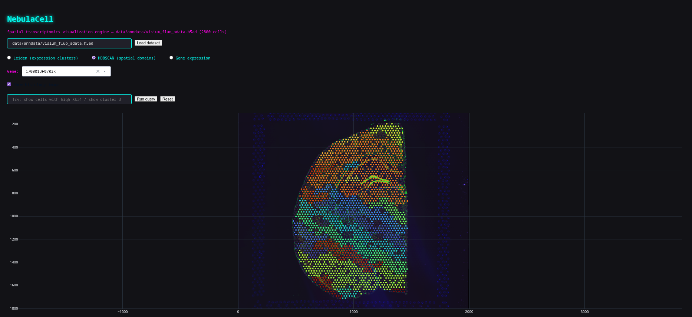
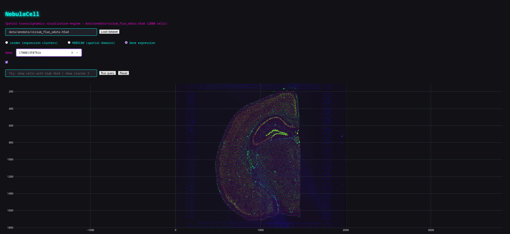
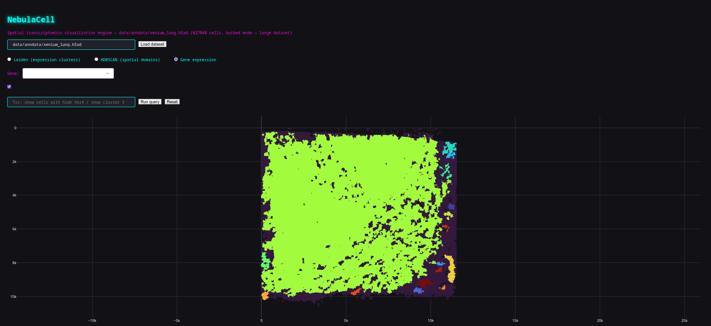

# NebulaCell

**Spatial transcriptomics visualization engine**, an interactive, GPU-accelerated dashboard for exploring spatial single-cell/spot data, with density-based tissue domain discovery and natural-language filtering.

Built with Dash, Scanpy, Squidpy, and HDBSCAN. Stress-tested on real public datasets from **2,800 to 827,000+ cells** across Visium, MERFISH, and Xenium assay types.

---

## Why NebulaCell

Spatial transcriptomics data couples gene expression with physical tissue coordinates, but most exploratory tooling either doesn't scale past a few thousand points or requires notebook-driven analysis for every question. NebulaCell aims for an interactive middle ground: load a real `.h5ad` file, explore it visually, and query it in plain language — all in a browser tab.

## Features

- **GPU-accelerated spatial rendering** (WebGL via Plotly `Scattergl`): tested up to 827,000 cells without the browser choking, something plain SVG-based scatter plots can't handle past ~10-20k points.
- **Histology image overlay**: automatically extracts and aligns the tissue image from Visium-style `.h5ad` files (`adata.uns['spatial']`), correctly scaled to match spot coordinates. Degrades gracefully for imaging-based assays (MERFISH, Xenium) that have no histology image.
- **Dual clustering views**: toggle between expression-based Leiden clusters (if present in the dataset) and independently-computed HDBSCAN spatial domains.
- **Adaptive HDBSCAN tuning**: default clustering parameters auto-scale to dataset size, with a live "Recluster" control to tune `min_cluster_size`/`min_samples` and re-run instantly without reloading data.
- **Live gene expression exploration**: a searchable gene dropdown recolors the entire dataset by any gene's expression, and hover tooltips show each cell's top-expressed genes plus the selected gene's value.
- **Natural language query filtering**: type queries like `show cells with high Xkr4` or `show cluster 3` to highlight matching cells; a rule-based parser (no LLM API cost) validates against the actual dataset schema before applying any filter.
- **Real-world `.h5ad` loading**: point it at any spatial `.h5ad` file via a path input; automatically chooses in-memory vs. backed-mode loading based on actual matrix size (cells × genes), not cell count alone.

## Screenshots

| Leiden clusters + histology overlay | HDBSCAN spatial domains (827k cells) |
|---|---|
|  |  |

| Gene expression coloring | NL query filtering |
|---|---|
|  |  |

**Large-scale rendering** — 827,048 cells (10x Xenium human lung), rendered live in-browser:

## Quick Start

\`\`\`bash
git clone https://github.com/Eswar-mse/Nebulacell.git
cd Nebulacell/nebulacell

python -m venv .venv
source .venv/bin/activate       # or: .venv\Scripts\activate on Windows

pip install -r ../requirements.txt

python -m app.main
\`\`\`

Open `http://127.0.0.1:8050` in your browser. The app loads a small built-in demo dataset (Visium mouse brain, 2,800 cells) on startup — no data download or setup required to try it out.

To load your own data, see [USAGE.md](USAGE.md).

## Architecture

| Layer | Technology |
|---|---|
| Dashboard / UI | Dash (Plotly) |
| Rendering | Plotly `Scattergl` (WebGL) |
| Data handling | Scanpy, AnnData |
| Spatial data | Squidpy |
| Clustering | HDBSCAN |
| NL query parsing | Rule-based regex parser (no external API) |

\`\`\`
nebulacell/
├── app/
│   ├── main.py                    # Dash app entrypoint, layout, callbacks
│   ├── data/
│   │   ├── loader.py               # .h5ad loading, in-memory vs backed-mode logic
│   │   └── image_overlay.py        # Histology image extraction (Visium uns['spatial'])
│   ├── clustering/
│   │   └── hdbscan_runner.py       # Spatial domain clustering, adaptive param scaling
│   ├── callbacks/
│   │   └── hover.py                 # Top-genes-per-cell, gene expression lookups
│   └── nlquery/
│       └── parser.py                # NL → structured filter parsing + validation
└── tests/
\`\`\`

## Known Limitations (v1)

Being upfront about what this doesn't do yet:

- **No true out-of-core computation.** "Backed mode" loading currently only speeds up the initial file read for very large datasets; clustering and gene-lookup computations still materialize the full matrix into memory before running. Real streaming/chunked computation is a planned v2 item.
- **Gene identifiers depend on the source file.** Some public datasets (e.g. certain Xenium exports) store Ensembl IDs rather than gene symbols — NebulaCell displays whatever the file provides, with no symbol-mapping layer yet.
- **NL query grammar is intentionally narrow.** It handles gene-expression-level and cluster-membership queries via pattern matching — not a general-purpose natural language interface. This is a deliberate choice (zero API cost, fully predictable, no hallucination risk) rather than a stopgap.
- **Single-user, local-first design.** No authentication, multi-user session handling, or cloud deployment story yet — this is a research tool for one person's machine, not a hosted multi-tenant service.

## License

MIT — see [LICENSE](LICENSE).
